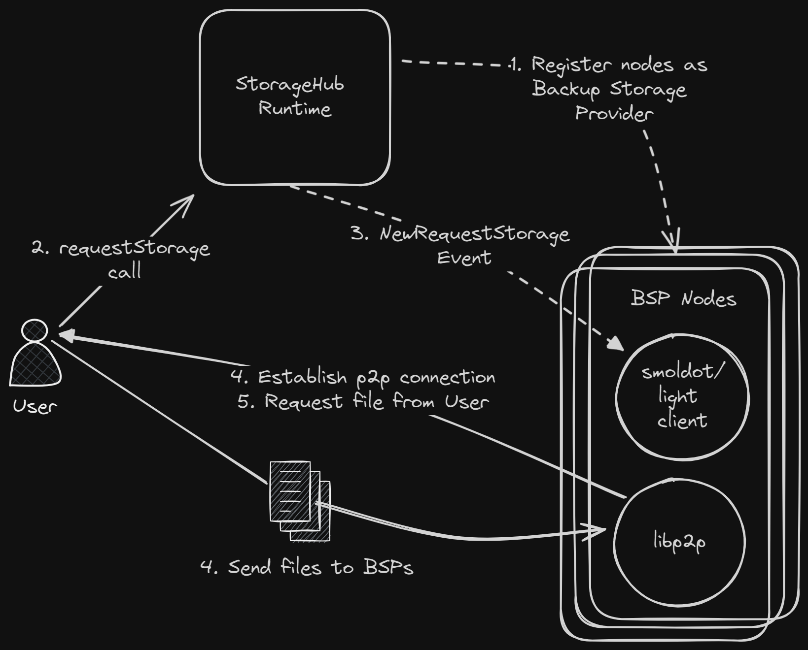
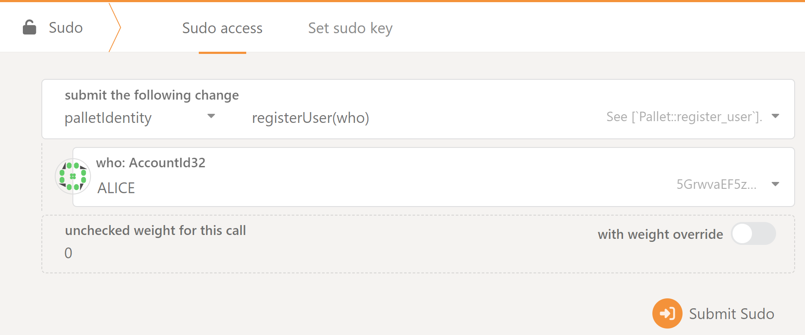
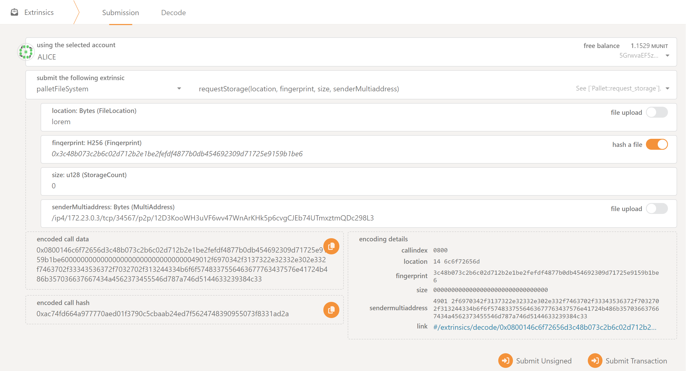

# StorageHub - PoC

## Overview

This proof of concept demonstrates the core functionality of the StorageHub system. The system allows users to store files on a decentralized network of backup storage providers (BSPs).

**What is included:**

- StorageHub runtime
- StorageHub client node
    1. User node
    2. Backup Storage Provider (BSP) node

## Architecture and Basic Execution Flow

The following diagram shows the basic architecture of the system and the flow of a file storage request.



1. StorageHub runtime registers the BSP node as a Backup Storage Provider.
2. User node sends a transaction `request_storage` to the StorageHub runtime to store a file.
3. StorageHub runtime deposits `NewRequestStorage` event.
4. BSP nodes receives the event and sends a transaction to the StorageHub runtime to volunteer `bsp_volunteer` to store the file.
5. BSP nodes attempt to establish connection with the User node and requests the file.
6. User node sends the file to the BSP nodes.

## Getting Started

Everything can be run through docker compose by running the following command:

```bash
docker compose up -d
```

This will start the following services:

- StorageHub runtime node
- User node

    The User node is built with the `./storagehub-client-node/files-to-upload` folder containing test files ready to upload to the StorageHub runtime.

- Backup Storage Provider (BSP) nodes

    1. bsp-1 (alice)
    2. bsp-2-1 (bob)
    3. bsp-3-1 (charlie)

    These nodes will connect to the StorageHub runtime as a light client and start listening for file storage requests events and send transactions to volunteer to store files.

    > Transactions are signed using the `--dev-account` flag. (e.g. `alice`, `bob`, `charlie`)

## Try it out

Before BSP nodes can volunteer to store files, they need to be registered with the StorageHub runtime.

Execute the pallet Identity `registerUser` extrinsic in the [sudo](https://polkadot.js.org/apps/#/sudo) page for each of the BSP nodes account (e.g. `alice`, `bob`, `charlie`)



Next, request to store a file by executing the pallet StorageHub `requestStorage` extrinsic in the [extrinsics](https://polkadot.js.org/apps/#/extrinsics) page.



The important parameters to fill in is the:

- `location`: The name of the file (e.g. `lorem`, `lorem-x`)
- `senderMultiaddress`: The multiaddress of the User node (use the public address multiaddress, not the localhost). This is used by the BSP nodes to establish a connection with the User node to request the file.

Now we can observe the following logs.

BSP (alice) node logs:

```log
2023-12-12T20:54:21.878740Z  INFO libp2p_swarm: local_peer_id=12D3KooWSvD9mjiZsCxwH5zkJBTUELZYQ7qxpRw7NRYt8212GXWD
2023-12-12T20:54:21.879046Z  INFO storagehub_client::p2p::service: Node starting up with peerId PeerId("12D3KooWSvD9mjiZsCxwH5zkJBTUELZYQ7qxpRw7NRYt8212GXWD")
2023-12-12T20:54:21.879298Z  INFO storagehub_client::p2p::swarm: [SwarmEvent::NewListenAddr] - listen address: /ip4/127.0.0.1/tcp/35436/p2p/12D3KooWSvD9mjiZsCxwH5zkJBTUELZYQ7qxpRw7NRYt8212GXWD
2023-12-12T20:54:21.879362Z  INFO storagehub_client::p2p::swarm: [SwarmEvent::NewListenAddr] - listen address: /ip4/172.28.164.193/tcp/35436/p2p/12D3KooWSvD9mjiZsCxwH5zkJBTUELZYQ7qxpRw7NRYt8212GXWD
2023-12-12T20:54:21.894297Z  INFO storagehub_client::lightclient::client: Connected to Development network using ws://127.0.0.1:9944 * Substrate node Substrate Node vRuntimeVersion { spec_version: 100, transaction_version: 1 }
2023-12-12T20:54:21.894474Z  INFO storagehub_client::lightclient::local: Subscribe 'NewStorageRequest' on-chain finalized event
2023-12-12T21:05:13.987812Z  INFO storagehub_client::lightclient::local: Received NewStorageRequest event - account_id: 5GrwvaEF5zXb26Fz9rcQpDWS57CtERHpNehXCPcNoHGKutQY, peer: /ip4/127.0.0.1/tcp/44913/p2p/12D3KooWDV5MttiC2UGq1tGqsjC51ze89HtNv5xLJGi9XKChwFkq, file_id: lorem, content_hash: 0x0000…0000, size: 0
2023-12-12T21:05:31.842157Z  INFO storagehub_client::lightclient::local: Successfully volunteered for file_id: lorem
2023-12-12T21:05:32.007988Z  INFO storagehub_client::p2p::request_response: [RequestResponseEvent::Message::Response] - received FileResponse from peer 12D3KooWDV5MttiC2UGq1tGqsjC51ze89HtNv5xLJGi9XKChwFkq.
2023-12-12T21:05:32.008004Z  INFO storagehub_client::lightclient::local: Received file from peer PeerId("12D3KooWDV5MttiC2UGq1tGqsjC51ze89HtNv5xLJGi9XKChwFkq")
2023-12-12T21:05:32.008098Z  INFO storagehub_client::lightclient::local: File downloaded to: /tmp/downloaded-files/bob/lorem
```

Notice the important logs are:

- `Received NewStorageRequest event ...`: The BSP node has received the `NewStorageRequest` event from the StorageHub runtime and is ready to volunteer to store the file.

- `Successfully volunteered for file_id: lorem`: The BSP node has successfully volunteered to store the file after executing the `bsp_volunteer` extrinsic.

- `Received file from peer ...`: The BSP node has received the file from the User node.

- `File downloaded to: /tmp/downloaded-files/lorem`: The file has been downloaded to the BSP node.

> You can re-execute the `requestStorage` extrinsic for the other `lorem-x` files.

User node logs:

```log
2023-12-14 14:50:35 2023-12-14T19:50:35.823815Z  INFO libp2p_swarm: local_peer_id=12D3KooWFNnkbnfQC5zz9m8mMpXA73gqSTGMqMPVNkx2Cnw3jb6W
2023-12-14 14:50:35 2023-12-14T19:50:35.823937Z  INFO storagehub_client::p2p::service: Node starting up with peerId PeerId("12D3KooWFNnkbnfQC5zz9m8mMpXA73gqSTGMqMPVNkx2Cnw3jb6W")
2023-12-14 14:50:35 2023-12-14T19:50:35.824291Z  INFO storagehub_client::p2p::swarm: [SwarmEvent::NewListenAddr] - listen address: /ip4/127.0.0.1/tcp/34565/p2p/12D3KooWFNnkbnfQC5zz9m8mMpXA73gqSTGMqMPVNkx2Cnw3jb6W
2023-12-14 14:50:35 2023-12-14T19:50:35.824333Z  INFO storagehub_client::p2p::swarm: [SwarmEvent::NewListenAddr] - listen address: /ip4/172.20.0.6/tcp/34565/p2p/12D3KooWFNnkbnfQC5zz9m8mMpXA73gqSTGMqMPVNkx2Cnw3jb6W
2023-12-14 14:52:01 2023-12-14T19:52:01.598804Z  INFO storagehub_client::p2p::request_response: [RequestResponseEvent::Message::Request] - sending FileResponse to peer 12D3KooWQ5RrqmeLxyDARTiHxjSN1FfoDH7HP2qoMo6bYyKySimd.
2023-12-14 14:52:01 2023-12-14T19:52:01.598908Z  INFO storagehub_client::p2p::request_response: [RequestResponseEvent::Message::Request] - sending FileResponse to peer 12D3KooWDWSe3L4cYSjCBUScz6yQ6zouh1B3uHouTPmTza1uUwQ3.
2023-12-14 14:52:01 2023-12-14T19:52:01.598931Z  INFO storagehub_client::p2p::request_response: [RequestResponseEvent::Message::Request] - sending FileResponse to peer 12D3KooWSQnRZMx9WCp6Dc2jTFHAkDxdf3DTiVXCJfGDjvPPhutL.
```

Notice the important logs are:

- `sending FileResponse to peer ...`: The User node has sent the file to the BSP node. This happened 3 times because there are 3 BSP nodes that requested the file.

## Updating the Runtime

When updating the runtime, whether it is new types, extrinsic parameters, or events, the following command needs to be executed to generate the new metadata file that will be used by the User and BSP nodes.

```bash
# Generate the metadata file
# Note: This command assumes that the StorageHub runtime is running on port 9944 and connects to localhost by default.
subxt metadata -f bytes > local.scale

# Copy the metadata file to the storagehub-client-node/metadata directory
cp local.scale ./storagehub-client-node/metadata
```
