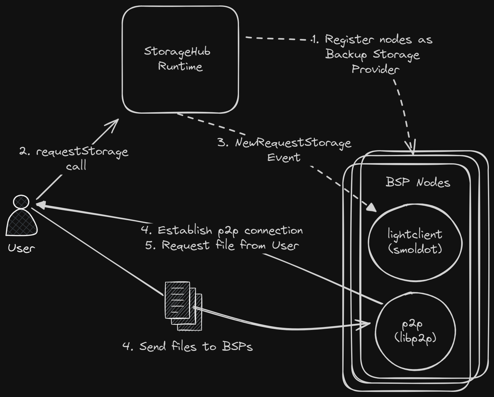

# StorageHub - PoC

## Overview

This proof of concept demonstrates the core functionality of the StorageHub system. The system allows users to store files on a decentralized network of backup storage providers (BSPs).

**What is included:**

- StorageHub runtime
- StorageHub client node
    1. User node
    2. Backup Storage Provider (BSP) node

## Architecture and Basic Execution Flow

The following diagram shows the basic architecture of the system and the flow of a file storage request.



1. StorageHub runtime registers the BSP node as a Backup Storage Provider.
2. User node sends a transaction `request_storage` to the StorageHub runtime to store a file.
3. StorageHub runtime deposits `NewRequestStorage` event.
4. BSP node receives the event and sends a transaction to the StorageHub runtime to volunteer `bsp_volunteer` to store the file.
5. BSP node attempts to establish connection with the User node and requests the file.
6. User node sends the file to the BSP node.

## Getting Started

Everything can be run through docker compose by running the following command:

```bash
docker compose up -d
```

This will start the following services:

- StorageHub runtime node
- User node

    The User node is built with the `./storagehub-client-node/files-to-upload` folder containing test files ready to upload to the StorageHub runtime.

- Backup Storage Provider (BSP) node

    This will connect to the StorageHub runtime as a light client and start listening for file storage requests events and send transactions to volunteer to store files.

    > Transactions are signed using Alice's keypair by default.

## Try it out

Before a BSP node can volunteer to store files, it needs to be registered with the StorageHub runtime. Since the BSP node signs transactions using Alice's keypair, we need to register Alice as a user.

Execute the pallet Identity `registerUser` extrinsic in the [sudo](https://polkadot.js.org/apps/#/sudo) page.


Next, request to store a file by executing the pallet StorageHub `requestStorage` extrinsic in the [extrinsics](https://polkadot.js.org/apps/#/extrinsics) page.


The important parameters to fill in is the:

- `location`: The name of the file (this is considered to by the id of the file).
- `senderMultiaddress`: The multiaddress of the User node. This is used by the BSP node to establish a connection with the User node to request the file.

Now we can observe the following logs from the BSP node:

```log
2023-12-06 15:39:25 2023-12-06T20:39:25.924784Z  INFO libp2p_swarm: local_peer_id=12D3KooWPjceQrSwdWXPyLLeABRXmuqt69Rg3sBYbU1Nft9HyQ6X
2023-12-06 15:39:25 2023-12-06T20:39:25.928845Z  INFO storagehub_client::client: Connected to Development network using ws://storagehub:9944 * Substrate node Substrate Node vRuntimeVersion { spec_version: 100, transaction_version: 1 }
2023-12-06 15:39:25 2023-12-06T20:39:25.928917Z  INFO storagehub_client::runtimes::local: Subscribe 'NewStorageRequest' on-chain finalized event
2023-12-06 15:39:26 2023-12-06T20:39:26.079171Z  INFO storagehub_client: Multiaddr listening on /ip4/127.0.0.1/tcp/23456/p2p/12D3KooWPjceQrSwdWXPyLLeABRXmuqt69Rg3sBYbU1Nft9HyQ6X
2023-12-06 15:39:26 2023-12-06T20:39:26.079304Z  INFO storagehub_client: Multiaddr listening on /ip4/172.23.0.4/tcp/23456/p2p/12D3KooWPjceQrSwdWXPyLLeABRXmuqt69Rg3sBYbU1Nft9HyQ6X
2023-12-06 16:44:55 2023-12-06T21:44:55.482623Z  INFO storagehub_client::runtimes::local: Received NewStorageRequest event - account_id: 5GrwvaEF5zXb26Fz9rcQpDWS57CtERHpNehXCPcNoHGKutQY, peer: /ip4/172.23.0.3/tcp/34567/p2p/12D3KooWH3uVF6wv47WnArKHk5p6cvgCJEb74UTmxztmQDc298L3, file_id: lorem, content_hash: 0x0000…0000, size: 0
2023-12-06 16:45:12 2023-12-06T21:45:12.837356Z  INFO storagehub_client::runtimes::local: Successfully volunteered for file_id: lorem
2023-12-06 16:45:12 2023-12-06T21:45:12.843654Z  INFO storagehub_client: Established new connection peer=12D3KooWH3uVF6wv47WnArKHk5p6cvgCJEb74UTmxztmQDc298L3 endpoint=Dialer { address: "/ip4/172.23.0.3/tcp/34567/p2p/12D3KooWH3uVF6wv47WnArKHk5p6cvgCJEb74UTmxztmQDc298L3", role_override: Dialer }
2023-12-06 16:45:12 2023-12-06T21:45:12.939965Z  INFO storagehub_client: Identify sent to PeerId("12D3KooWH3uVF6wv47WnArKHk5p6cvgCJEb74UTmxztmQDc298L3")
2023-12-06 16:45:12 2023-12-06T21:45:12.940466Z  INFO storagehub_client: Identify received: Info { public_key: PublicKey { publickey: Ed25519(PublicKey(compressed): 6b79c57e6a95239282c4818e96112f3f3a401ba97a564c23852a3f1ea5fc) }, protocol_version: "/storagehub/0.1.0", agent_version: "rust-libp2p/0.44.0", listen_addrs: ["/ip4/172.23.0.3/tcp/34567", "/ip4/127.0.0.1/tcp/34567"], protocols: ["/ipfs/id/push/1.0.0", "/storagehub/0.1.0", "/ipfs/id/1.0.0"], observed_addr: "/ip4/172.23.0.4/tcp/50216" }
2023-12-06 16:45:12 2023-12-06T21:45:12.940570Z  INFO storagehub_client: New external address candidate /ip4/172.23.0.4/tcp/23456
2023-12-06 16:45:12 2023-12-06T21:45:12.992677Z  INFO storagehub_client::runtimes::local: Received file from peer PeerId("12D3KooWH3uVF6wv47WnArKHk5p6cvgCJEb74UTmxztmQDc298L3")
2023-12-06 16:45:12 2023-12-06T21:45:12.993700Z  INFO storagehub_client::runtimes::local: File downloaded to: /tmp/downloaded-files/lorem
2023-12-06 16:45:12 2023-12-06T21:45:12.993726Z  INFO storagehub_client::runtimes::local: Waiting 3 seconds before run batch
2023-12-06 16:45:12 Dialing 12D3KooWH3uVF6wv47WnArKHk5p6cvgCJEb74UTmxztmQDc298L3
```

Notice the important logs are:

- `Received NewStorageRequest event ...`: The BSP node has received the `NewStorageRequest` event from the StorageHub runtime and is ready to volunteer to store the file.

- `Successfully volunteered for file_id: lorem`: The BSP node has successfully volunteered to store the file after executing the `bsp_volunteer` extrinsic.

- `Received file from peer ...`: The BSP node has received the file from the User node.

- `File downloaded to: /tmp/downloaded-files/lorem`: The file has been downloaded to the BSP node.

> You can re-execute the `requestStorage` extrinsic for the other `lorem-x` files.

## Updating the Runtime

When updating the runtime, whether it is new types, extrinsic parameters, or events, the following command needs to be executed to generate the new metadata file that will be used by the User and BSP nodes.

```bash
# Generate the metadata file
# Note: This command assumes that the StorageHub runtime is running on port 9944 and connects to localhost by default.
subxt metadata -f bytes > local.scale

# Copy the metadata file to the storagehub-client-node/metadata directory
cp local.scale ./storagehub-client-node/metadata
```
